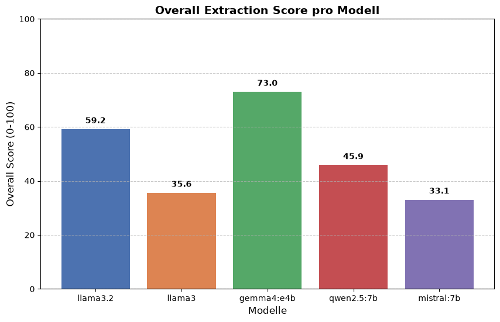
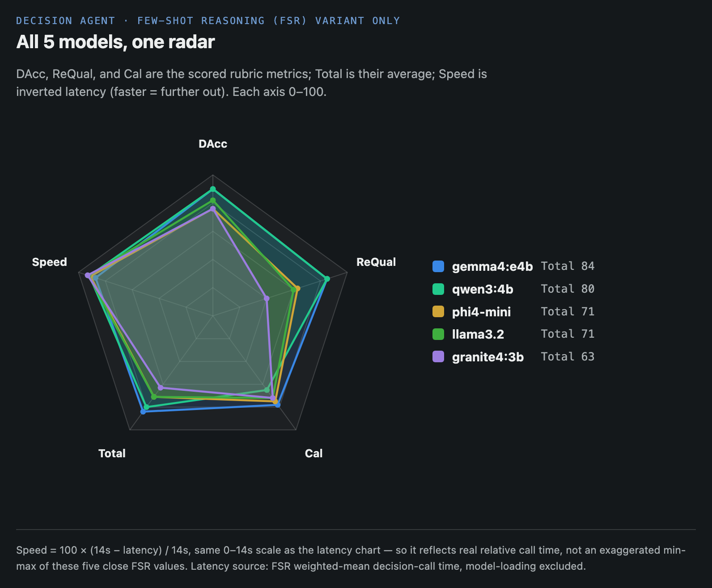

# AI Agents for Scientific Workflows

A multi-agent pipeline that recommends academic conferences to researchers.
Given a researcher's location and research topic, the system finds, filters, and scores upcoming conferences to help them decide which to attend.

**Authors:** Till Friedemann, Kilian Schröder, Aw Thura
**Institution:** Otto-von-Guericke-Universität Magdeburg, Faculty of Computer Science

---

## Research Questions

As of the 07.07.2026 progress presentation, framed per-agent around what's
actually measurable from the two benchmarks (see [Benchmark Results](#benchmark-results)):

| RQ | Question | Answered by |
|---|---|---|
| RQ1 | JSON Format Fidelity — how reliably do LLMs adhere to strict structural/syntactical formatting without manual intervention? | Discovery Agent extraction benchmark |
| RQ2 | Decision Quality — how do LLMs differ in quality when evaluating formatted data using a predefined rule-based scoring system? | Decision Agent benchmark (LLM-as-judge) |
| RQ3 | What model is the most compatible for each agent? | **Gemma4:e4b** — both Discovery and Decision agent |

---

## System Architecture

```
User Preferences (location + research topic)
        │
        ▼
┌───────────────────┐
│  Data Sources     │  CCF-Deadlines YAML, WikiCFP (scraper), EasyChair (scraper)
└────────┬──────────┘
         │  future_conferences.json
         ▼
┌───────────────────┐
│  Topic Pre-filter │  Keyword-based, no LLM — drops obvious topic mismatches
└────────┬──────────┘
         │
         ▼
┌───────────────────┐
│  Decision Agent   │  Ollama LLM — validates conference + checks relevance
│                   │  (few-shot prompted by default, see Models below)
└────────┬──────────┘
         │  accepted conferences
         ▼
┌───────────────────┐
│  Scoring System   │  Distance (30%) + Relevancy (50%) + Prestige (20%)
└────────┬──────────┘
         │
         ▼
    Ranked Results
```

### Scoring System

Each accepted conference is scored 0–100 on three axes:

| Axis | Method | Weight |
|---|---|---|
| **Relevancy** | LLM semantic match between research topic and conference scope | 50% |
| **Distance** | Haversine distance from researcher's address to conference city, exponential decay | 30% |
| **Prestige** | CORE rank: A*→100, A→80, B→55, C→30, Unranked→10 | 20% |

---

## Project Structure

```
AI_agents_for_science_workflows/
├── app.py                       # Gradio web GUI — primary interface (model dropdown, live log)
├── src/
│   ├── agents/
│   │   ├── decision.py          # Decision agent (LLM-based validation + relevance, few-shot prompted)
│   │   ├── scorer.py            # Scoring system (distance, relevancy, prestige)
│   │   ├── scraper.py           # WikiCFP web-scraping agent
│   │   ├── scraper2.py          # EasyChair web-scraping agent
│   │   └── ccfddl_conferences.py# Converts CCF-Deadlines YAML → JSON
│   ├── benchmark/
│   │   ├── benchmark_pipeline.py          # Extraction benchmark (JSON-parsing accuracy per model)
│   │   ├── decision_scoring_benchmark.py  # Decision/scoring quality benchmark (6 models x 20 profiles)
│   │   ├── decision_scoring_profiles.py   # The 20 synthetic researcher profiles used above
│   │   ├── decision_scoring_rubric.md     # Rubric for judging decision/scoring quality
│   │   └── claude_judgments.md            # Claude-as-judge results + hallucination-mitigation experiments
│   ├── fetcher/
│   │   └── ccf-deadlines_fetcher.py  # Downloads CCF-Deadlines repo from GitHub
│   ├── schemas/
│   │   └── conference.py        # Pydantic models (Conference, UserPreferences, etc.)
│   ├── tools/
│   │   ├── firecrawl_tool.py    # Firecrawl wrapper (WikiCFP, EasyChair, CORE)
│   │   └── geocoding.py         # Address → coordinates + Haversine distance
│   ├── graph.py                 # LangGraph pipeline definition
│   ├── main.py                  # Interactive CLI entry point
│   ├── test_pipeline.py         # End-to-end benchmark test (multi-model, multi-profile)
│   └── test_run.py              # Scraper-based test entry point
├── scripts/
│   ├── setup_ollama.sh          # One-time Ollama install + model pull on cluster
│   ├── setup_env.sh             # Python venv + requirements install on cluster
│   ├── start_ollama.sh          # Start Ollama server in a screen session (pre-loads default model)
│   ├── start_gui.sh             # Start the Gradio GUI in a screen session
│   ├── run_decision_benchmark.sh# Run the decision/scoring benchmark in a screen session
│   ├── watch_benchmark.py       # Live tqdm progress bar for a running benchmark
│   └── check_status.sh          # Read-only status check: Ollama, GUI, tunnel (run on the cluster)
├── docs/
│   └── architecture.md          # Detailed architecture documentation
├── temp/                        # Gitignored — scraped conference cache
├── requirements.txt
└── README.md
```

---

## Setup (OVGU AILab Cluster)

### 1. Clone the repo

```bash
git clone git@github.com:Awthura/AI_agents_for_science_workflows.git
cd AI_agents_for_science_workflows
```

### 2. Install Ollama

```bash
bash scripts/setup_ollama.sh
```

This downloads the Ollama binary to `/project/${LOGNAME}/ollama/`, sets up env vars in `~/.bashrc`, and pulls the default models (see Models below).

### 3. Set up Python environment

```bash
bash scripts/setup_env.sh
source venv/bin/activate
```

### 4. Start Ollama (every session)

```bash
bash scripts/start_ollama.sh
```

### 5. Start the web GUI (every session)

```bash
bash scripts/start_gui.sh
```

Access at `http://<zone>:7860` (via SSH tunnel — see `docs/architecture.md`
for the tunnel command). Pick a model from the dropdown, enter an address
and research topic, and click **Run pipeline**. The dropdown shows a green
"ready" mark next to whichever model Ollama currently has loaded in memory.

---

## Running the Pipeline

### Web GUI (recommended)

```bash
python app.py           # full pipeline, requires Ollama running
python app.py --demo     # demo mode with fake data, no Ollama needed
```

### Fetch conference data

```bash
python src/fetcher/ccf-deadlines_fetcher.py   # download YAML from CCF-Deadlines GitHub
python src/agents/ccfddl_conferences.py        # convert YAML → future_conferences.json
```

### Run benchmark test (multi-model, multi-profile)

```bash
screen -S pipeline
python src/test_pipeline.py
```

Runs all profiles defined in `TEST_PROFILES` against all models in `TEST_MODELS` and saves results to `pipeline_results.json`.

### Run interactive CLI

```bash
python src/main.py
```

Prompts for location and research topic, then runs the full pipeline and prints a ranked table.

---

## Data Sources

| Source | Method | Status |
|---|---|---|
| **CCF-Deadlines** | GitHub YAML download (no scraping) | Working on cluster |
| **WikiCFP** | Firecrawl scraping | Blocked by cluster proxy |
| **EasyChair** | Firecrawl scraping | Blocked by cluster proxy |

> The CCF-Deadlines source is the primary data source for cluster runs.
> Scraping-based sources work locally when Firecrawl is running.

---

## Models

All 6 models are served locally via Ollama on the cluster (`scripts/setup_ollama.sh` pulls all of them):

| Model | Notes |
|---|---|
| `gemma4:e4b` | Default / pre-loaded. Best performer on both the extraction benchmark (73/100) and the decision/scoring benchmark (see `src/benchmark/claude_judgments.md`) |
| `llama3.2` | |
| `phi4-mini` | |
| `qwen3:4b` | Tied for best decision/scoring accuracy with gemma4:e4b |
| `granite4:3b` | |
| `deepseek-r1:7b` | Reasoning model — currently has a parse-failure issue under some configurations (see `claude_judgments.md`), needs a clean re-run to confirm the fix |

Only one model is kept loaded in Ollama's memory at a time
(`OLLAMA_MAX_LOADED_MODELS=1`, set by `scripts/start_ollama.sh`) — switching
models in the GUI dropdown evicts the previous one automatically. Loading
only happens lazily on "Run pipeline" click, not on dropdown change.

For CLI use, switch model via environment variable:
```bash
OLLAMA_MODEL=qwen3:4b python src/test_pipeline.py
```

### Decision agent prompting

The decision agent (`src/agents/decision.py`) uses **few-shot prompting** by
default in the live pipeline — 4 worked examples in the system prompt that
improved accuracy and reasoning quality for every one of the 5 benchmarked
models (`deepseek-r1:7b` excluded, see note above), at no added latency
(see `src/benchmark/claude_judgments.md`'s "Few-Shot Prompting Experiment"
for the full write-up, including a head-to-head comparison against a
self-validation approach that was tried first and found to be net-negative
for most models).

---

## Benchmark Results

### RQ1 — Discovery Agent: JSON Format Fidelity

Extraction benchmark (`src/benchmark/benchmark_pipeline.py`): can each model
turn scraped source text into schema-exact JSON — valid syntax, no
hallucinated/missing keys, no conversational wrappers around the JSON?
Scored 0–100 (60% information gathering via F1-score, 40% detail accuracy),
with penalties for wrong schema (−10), markdown fences (−5), or swapped
IDs/hallucinations (−2 each). See `src/benchmark/benchmark_4_with_score/evaluation_results.md`.



| Model | Score |
|---|---|
| **gemma4:e4b** | **73.0** |
| llama3.2 | 59.2 |
| qwen2.5:7b | 45.9 |
| llama3 | 35.6 |
| mistral:7b | 33.1 |

### RQ2 — Decision Agent: Decision Quality

No ground truth exists for "is this conference relevant" the way it does for
extraction — it's a judgment call. So the decision agent is graded via
**LLM-as-a-judge**: an independent model (Claude Sonnet 5) reaches its own
blind verdict before ever seeing the target model's actual decision, avoiding
anchoring bias (the standard "judge blind, then reveal and compare" protocol —
see `src/benchmark/decision_scoring_rubric.md`, `claude_judgments.md`).

```
Run  →  Judge (blind)  →  Reveal & compare  →  Score
```

Scored equally (33.33% each) on:

| Metric | Method |
|---|---|
| **DAcc** (Decision Accuracy) | Judge's blind accept/reject vs. the model's actual call |
| **ReQual** (Reasoning Quality) | The `reason` string rated 1–5, independent of whether the decision was correct |
| **Cal** (Relevancy Calibration) | `100 − mean(|model score − judge score|)` on accepted conferences |

Two optimization techniques were tried against the **Generic** (single-prompt)
baseline, across all 5 non-`deepseek-r1:7b` models (excluded — unresolved
parse failure):

| Method | Explanation |
|---|---|
| **Generic** | A single-prompt LLM call — the baseline |
| **Self-Validation (-SV)** | A second LLM call reviews the first decision for hallucination/over-acceptance before finalizing |
| **Few-Shot Reasoning (-FSR)** | Worked examples added directly to the system prompt, showing correct-vs-wrong reasoning for known fabrication patterns |

**Table 1 — full results, 5 models × 3 variants** (bold = best per column):

| Model | Variant | DAcc | ReQual | Cal | Total |
|---|---|---|---|---|---|
| gemma4:e4b | Generic | 85 | 70 | 75 | 77 |
| | SV | 86 | 63 | 75 | 75 |
| | FSR | **90** | **85** | **78** | **84** |
| qwen3:4b | Generic | 87 | 78 | 65 | 77 |
| | SV | 79 | 72 | 65 | 72 |
| | FSR | **90** | **85** | 65 | 80 |
| phi4-mini | Generic | 73 | 60 | 75 | 69 |
| | SV | 60 | 55 | 72 | 62 |
| | FSR | 76 | 63 | 75 | 71 |
| llama3.2 | Generic | 78 | 47 | 70 | 65 |
| | SV | 58 | 50 | 65 | 58 |
| | FSR | 82 | 60 | 72 | 71 |
| granite4:3b | Generic | 72 | 25 | 72 | 56 |
| | SV | 65 | 48 | 70 | 61 |
| | FSR | 76 | 40 | 72 | 63 |

*Total is an equal-weighted average of DAcc/ReQual/Cal (minus any triggered
penalties), not a sum — e.g. gemma4:e4b Generic: (85+70+75)/3 = 76.67 ≈ 77.*

**Table 2 — delta vs. Generic baseline, same model** (bold = best per column):

| Model | Variant | ΔDAcc | ΔReQual | ΔCal | ΔTotal |
|---|---|---|---|---|---|
| gemma4:e4b | SV | +1 | −7 | 0 | −2 |
| | FSR | **+5** | +15 | **+3** | **+7** |
| qwen3:4b | SV | −8 | −6 | 0 | −5 |
| | FSR | +3 | +7 | 0 | +3 |
| phi4-mini | SV | −13 | −5 | −3 | −7 |
| | FSR | +3 | +3 | 0 | +2 |
| llama3.2 | SV | −20 | +3 | −5 | −7 |
| | FSR | +4 | +13 | +2 | +6 |
| granite4:3b | SV | −7 | **+23** | −2 | +5 |
| | FSR | +4 | +15 | 0 | **+7** |

**The headline result**: Self-Validation is net-negative for 4 of 5 models
(a "skeptical reviewer" framing introduces a systematic reject-bias), while
Few-Shot Reasoning improves every single model at **zero added latency or
LLM calls** — the cheaper technique won outright. This is why `few_shot=True`
is the live default (see below) and self-validation was never shipped.

**Table 3 — FSR mean decision-call latency**, model-loading excluded (bold = fastest):

| Model | gemma4:e4b | qwen3:4b | phi4-mini | llama3.2 | granite4:3b |
|---|---|---|---|---|---|
| Latency (s) | 1.78 | 1.14 | 1.24 | 1.03 | **0.96** |

All 5 FSR-variant models on one radar (DAcc, ReQual, Cal, Total, and Speed —
inverted latency, so faster sits further out):



### RQ3 — Best Model Per Agent

| Agent | Best model |
|---|---|
| Discovery Agent | **gemma4:e4b** |
| Decision Agent | **gemma4:e4b** |

`gemma4:e4b` wins both benchmarks outright — independent cross-validation
across two different tasks. `qwen3:4b` is a close second on decision quality
(FSR total 80 vs. 84) and, on the FSR variant, is also faster than
gemma4:e4b (1.14s vs. 1.78s/call — Table 3). That's a reversal from the
Generic baseline, where `qwen3:4b` was by far the slowest model tested
(10–18s/call, see `claude_judgments.md`) — a reminder that these two
optimization techniques change more than just quality scores, they can
reshuffle relative latency between models too.

---

## Dependencies

See `requirements.txt`. Key packages:

- `langgraph` — agent orchestration
- `langchain-ollama` — Ollama LLM integration
- `firecrawl-py` — web scraping
- `geopy` — address geocoding
- `pydantic` — data validation
- `rich` — terminal output
- `gradio` — web GUI
- `tqdm` — benchmark progress bars
