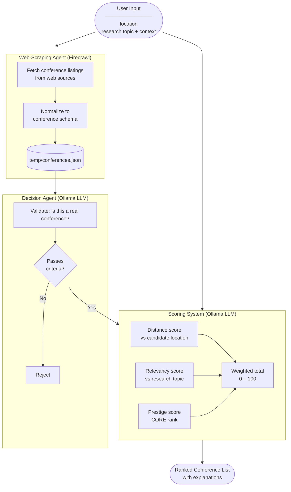
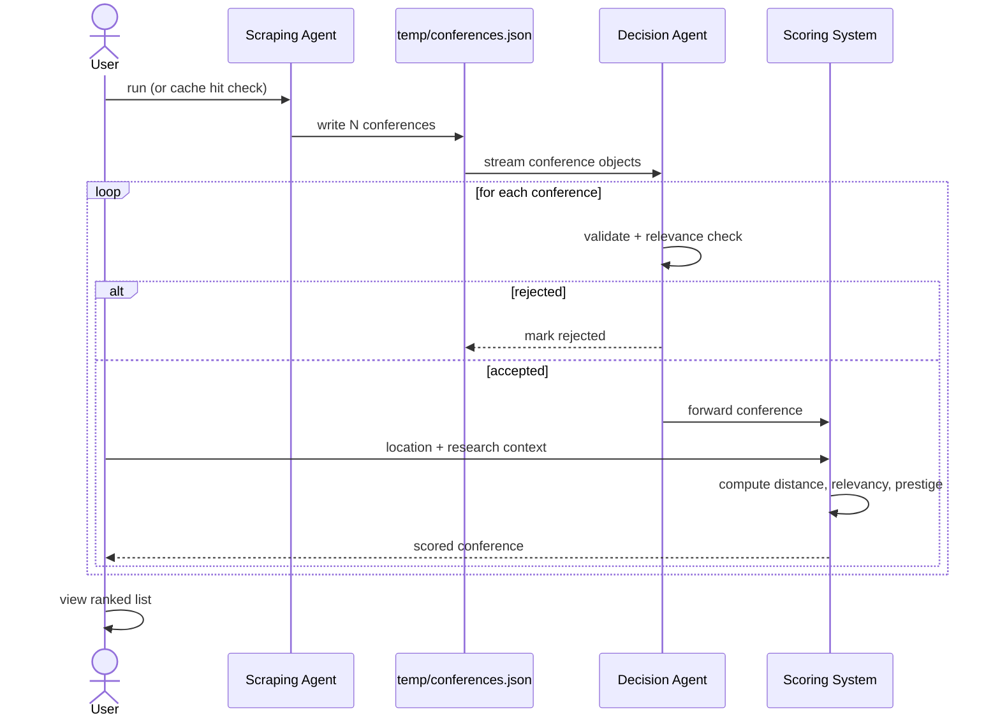

# Architecture: AI Agents for Scientific Workflow

## System Purpose

A multi-agent pipeline that recommends academic conferences to researchers. The user provides their location and research context; the system scrapes upcoming conferences, validates and filters them, then scores each one against the user's preferences.

---

## High-Level Pipeline



---

## Component Details

### 1. Web-Scraping Agent

| Property | Value |
|---|---|
| Technology | Firecrawl (primary), Tavily (fallback) |
| Trigger | Manual run or scheduled (e.g., weekly) |
| Output | `temp/conferences.json` |
| Scope | Conferences with deadlines/dates in the next 12 months |
| Cache policy | Re-use file if `scraped_at` is less than 7 days old |

**Responsibilities:**
- Fetch conference listings from sources (WikiCFP, CORE portal, conference aggregators)
- Parse and normalize raw HTML/markdown into the conference schema
- Deduplicate entries (same conference from multiple sources)
- Write structured output to `temp/conferences.json`

---

### 2. Decision Agent

| Property | Value |
|---|---|
| Technology | Ollama (local LLM hosting) |
| Models (under evaluation) | Gemma 4 E4B, Llama 4, Kimi-K2.5, GPT-OSS |
| Input | Single conference JSON object |
| Output | `valid: bool`, `relevant: bool`, `reason: str` |

**Responsibilities:**
- **Validity check**: is this entry actually an academic conference (not a workshop, seminar, journal, or spam)?
- **Relevance check**: does the conference topic area overlap with the candidate's research?
- Output a structured decision with a brief natural-language reason

**Decision logic:**
```
if not valid → reject (log reason)
if valid but not relevant → reject (log reason)
if valid and relevant → forward to Scoring System
```

---

### 3. Scoring System

| Property | Value |
|---|---|
| Technology | Ollama LLM (relevancy) + deterministic computation (distance, prestige) |
| Input | Validated conference + user preferences |
| Output | Score object: `{distance, relevancy, prestige, total}` on 0–100 scale |

**Score dimensions:**

| Dimension | Method | Weight (tentative) |
|---|---|---|
| **Distance** | Haversine distance from user address to conference city | 30% |
| **Relevancy** | LLM semantic match between research topic and conference scope | 50% |
| **Prestige** | CORE rank mapping: A*→100, A→75, B→50, C→25, Unranked→10 | 20% |

---

### 4. Orchestration

| Option | Pros | Cons |
|---|---|---|
| **LangGraph** | Python-native, fine-grained agent control, good for research logging | More setup |
| **n8n** | Visual, low-code, easy to demo | Less control, harder to version |

**Current preference: LangGraph** — better fit for Python stack, supports swapping Ollama models per node, and produces reproducible runs for RQ1/RQ2 evaluation.

---

## Data Flow Diagram



---

## Directory Structure (planned)

```
AI_agents_for_science_workflows/
├── docs/
│   └── architecture.md          # this file
├── src/
│   ├── schemas/
│   │   └── conference.py        # Pydantic models
│   ├── agents/
│   │   ├── scraper.py           # Web-scraping agent
│   │   ├── decision.py          # Decision agent
│   │   └── scorer.py            # Scoring system
│   ├── tools/
│   │   ├── firecrawl_tool.py    # Firecrawl wrapper
│   │   └── geocoding.py         # Address → coordinates
│   ├── graph.py                 # LangGraph pipeline definition
│   └── main.py                  # Entry point
├── temp/                        # gitignored — scraped data cache
├── tests/
├── .env                         # gitignored — API keys
├── .gitignore
├── requirements.txt
└── README.md
```

---

## Research Questions Mapping

| RQ | What we vary | What we measure |
|---|---|---|
| RQ1: Best model per agent | Swap Ollama model in Decision Agent | Accuracy of valid/relevant classification |
| RQ2: Model performance on tasks | Same model across scraping + decision | F1 / precision on benchmark set |
| RQ3: Complex preferences | Vary user input (location, niche topics) | Score consistency and ranking quality |

---

## Open Questions

- **User interface**: CLI prompt vs web form vs API endpoint for collecting preferences
- **Explainability (XAI)**: include natural-language justification per recommendation
- **Score consistency**: how much do scores vary across runs with the same input?
- **Sources**: which conference listing sites to scrape (WikiCFP, CORE portal, others)?
