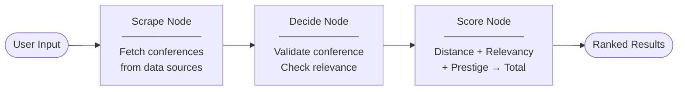
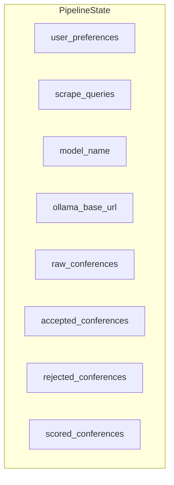
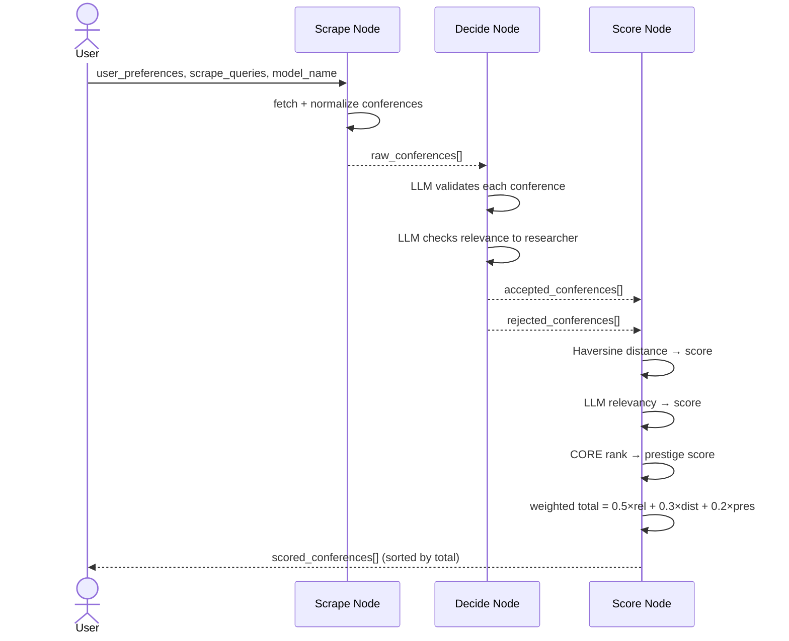

# LangGraph Pipeline

This project uses [LangGraph](https://github.com/langchain-ai/langgraph) to orchestrate three agents as a stateful directed graph. Each node is an agent function; state is passed between nodes automatically.

---

## Node Graph



---

## Pipeline State

All nodes share a single `PipelineState` TypedDict. Each node reads from it and writes back a partial update.



---

## Data Flow Between Nodes



---

## Node Details

### Scrape Node (`scrape_node`)

| Property | Value |
|---|---|
| Input from state | `scrape_queries`, `model_name`, `ollama_base_url`, `cache_path` |
| Output to state | `raw_conferences` |
| Technology | Firecrawl (scraping) or CCF-Deadlines YAML (direct) |
| LLM use | Yes — extracts structured JSON from raw HTML/markdown |

Fetches conference listings from data sources, normalizes them into the `Conference` schema, and caches to `temp/conferences.json`.

---

### Decide Node (`decide_node`)

| Property | Value |
|---|---|
| Input from state | `raw_conferences`, `user_preferences`, `model_name` |
| Output to state | `accepted_conferences`, `rejected_conferences` |
| Technology | Ollama LLM via LangChain `ChatOllama` |
| LLM use | Yes — one call per conference |

For each conference, the LLM answers:
1. Is this a real, standalone academic conference?
2. Is the topic directly relevant to the researcher's field?

Returns `valid`, `relevant`, and a one-sentence `reason`.

---

### Score Node (`score_node`)

| Property | Value |
|---|---|
| Input from state | `accepted_conferences`, `user_preferences`, `model_name` |
| Output to state | `scored_conferences` |
| Technology | Haversine (deterministic) + Ollama LLM (relevancy) + CORE rank (lookup) |
| LLM use | Yes — one call per conference for relevancy score |

Scores each accepted conference on three axes:

| Axis | Weight | Method |
|---|---|---|
| Relevancy | 50% | LLM rates 0–100 topic match |
| Distance | 30% | Haversine km → exponential decay score |
| Prestige | 20% | CORE rank: A*→100, A→80, B→55, C→30, Unranked→10 |

```
Total = 0.50 × Relevancy + 0.30 × Distance + 0.20 × Prestige
```

---

## Graph Construction (code)

```python
from langgraph.graph import END, StateGraph

graph = StateGraph(PipelineState)

graph.add_node("scrape", scrape_node)
graph.add_node("decide", decide_node)
graph.add_node("score",  score_node)

graph.add_edge("scrape", "decide")
graph.add_edge("decide", "score")
graph.add_edge("score",  END)

graph.set_entry_point("scrape")

pipeline = graph.compile()
result = pipeline.invoke(initial_state)
```

---

## Why LangGraph?

| Feature | Benefit for this project |
|---|---|
| Stateful graph | All agents share typed state — no manual data passing |
| Node isolation | Each agent is a pure function — easy to swap or test individually |
| Model-agnostic | `model_name` in state means any Ollama model can be injected at runtime |
| Reproducible runs | Same graph, different model → direct comparison for RQ1/RQ2 |
| Extensible | New agents (e.g. a re-ranking node) can be added as new nodes without touching existing ones |
